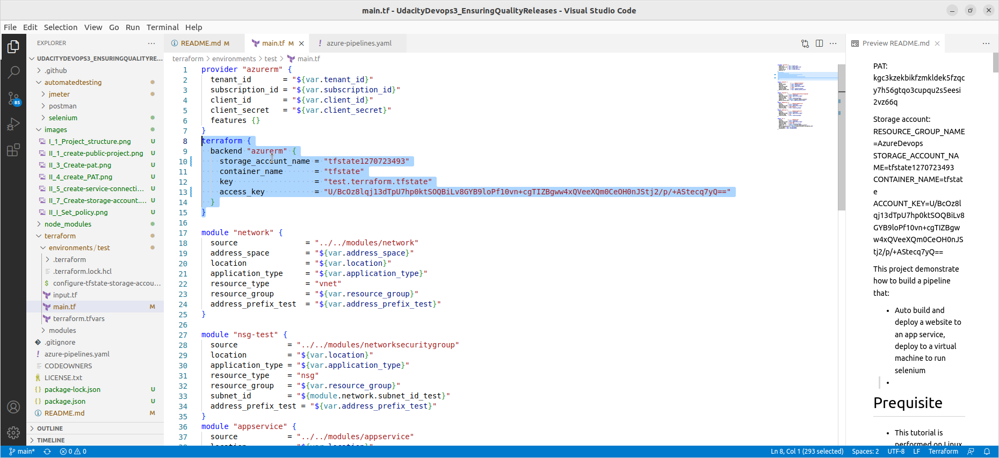

PAT: kgc3kzekbikfzmkldek5fzqcy7h56gtqo3cupqu2s5eesi2vz66q

Storage account:
RESOURCE_GROUP_NAME=AzureDevops
STORAGE_ACCOUNT_NAME=tfstate1270723493
CONTAINER_NAME=tfstate
ACCOUNT_KEY=U/BcOz8lqj13dTpU7hp0ktSOQBiLv8GYB9loPf10vn+cgTIZBgww4xQVeeXQm0CeOH0nJStj2/p/+AStecq7yQ==


This project demonstrate how to build a pipeline that:
* Auto build and deploy a website to an app service, deploy to a virtual machine to run selenium
* 

# Prequisite
* This tutorial is performed on Linux Ubuntu 20.04 LTS
* You have to install:
    * Azure CLI
    * Visual studio code (VS code)
    * Terraform (If you wish to test terraform step on local)
    * Postman
    * Jmeter
    * Selenium

# I. Setup azure devops
## 1. Clone the project
* Open bash and clone project using this command:

``` bash
$ git clone https://github.com/nghianv201096/UdacityDevops3_EnsuringQualityReleases.git
```

* Go to project folder and open it with VS code:
``` bash
$ cd UdacityDevops3_EnsuringQualityReleases.git
$ code .
```

* After you finish then you will see the structure of the project like this:

There are several important folders:
    * **automatedtesing**: the folder contains automated tests for *Jmeter*(performnace testing), *Postman*(data testing), *Selenium*(UI testing)
    * **terraform**: the folder contains all files related to manage infrastructure with terraform
        * **enviroments**: separate code folders for each environment, eg: dev, test, prod,... This project demonstrate only for test environment called *test* folder which contains:
            * *main.tf* : the start point for creating resources, will import modules in *terraform/modules* folder. 
            * *input.tf* : define variables as inputs for *main.tf* file above for reuse purpose
            * *terraform.tfvars*: add values for inputs defined in input.tf.
        * **modules**: contains different modules like: app-service, virtual-machine,... that are used in *main.tf* each module has:
            * file for define the resource, eg: appservice.tf
            * file for define inputs of appservice.tf, eg: input.tf
    * **azure-pipelines.yaml** file define a pipeline for create infrastructure, buid code, deploy, test. In later steps when we create a pipeline in Azure Devops we will use this existing file.


## 2. Login to azure devops
Go to https://dev.azure.com and login using your azure account.

## 3. Get PAT
* Go to user settings > Create new token for create a new agent pool later.


Then copy and save the token for later use.

## 4. Create a project
* Allow create public projects


* Create a public project


## 5. Create a service connection to Azure
Create a service connection that enable terraform to access to Azure resource for creating resources:


## 6. Create a service principal
Create a service principal for terraform uses later.
```
$az ad sp create-for-rbac --role="Contributor" --scopes="/subscriptions/_subscription_id"
```
## 7. Create storage account for store terraform state
* Open bash in the project and login:
```
$ az login
```

* Run bellow commands and copy the storage account info for later use in terraform:
```
$ cd cd terraform/environments/test/
$ ./configure-tfstate-storage-account.sh
```


# II. Update configuration in the project configuration
## 1. Configure the storage for store terraform storage using output of [this](#7-create-storage-account-for-store-terraform-state) step
* Update the storage in main.tf


* Update the storage in terraform.varstf


## 2. Configure the service principal
* Update the terraform.tfvars using ouput in [this](#6-create-a-service-principal) step


**Note:** you might want to update username and password of virtual machine used for agent pool as well in line 20,21
## 3. Test terraform in local
You can test terraform in local by using these commands:
```
# Init
$ terraform init

# Output a plan
$ terraform plan -out Solution.plan

# Apply the plan
$ terraform apply Solution.plan
```

After you can see the changes in console and go to portal site to see the list of created resources

# III. Crete a pipeline
## 1. Create pipeline

## 2. Use the existing yaml file

# IV. Result

## 1. Execution terraform successfully

## 2. Execution of the whole pipeline successfully

## 3. Execution result of postman.

## 4. Execution result of Selenium and logging.

## 5. Execution result of Jmeter.
* an HTML resport

* log output of Jmeter in CI/CD

## 6. Alerts were triggered by AppService for NotFound requests
* Email sent by azure

* The resource triggers alerts

* The alert rule

* Resources' metric

## 7. Log analytic query of AppService